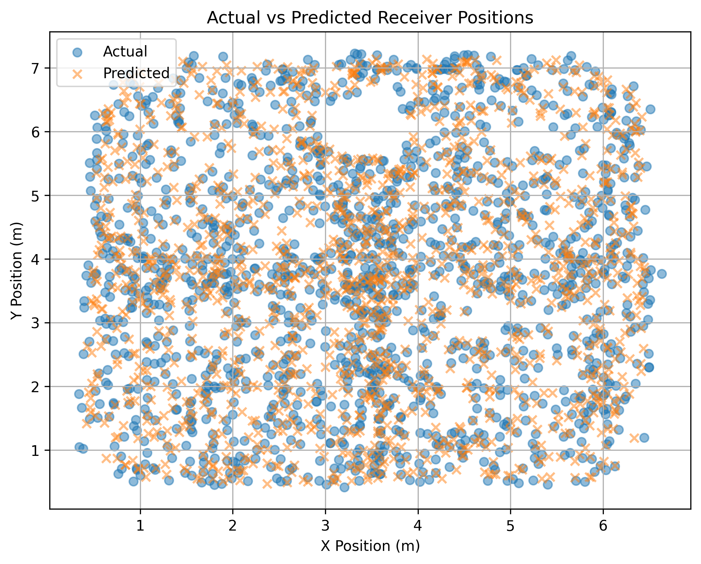
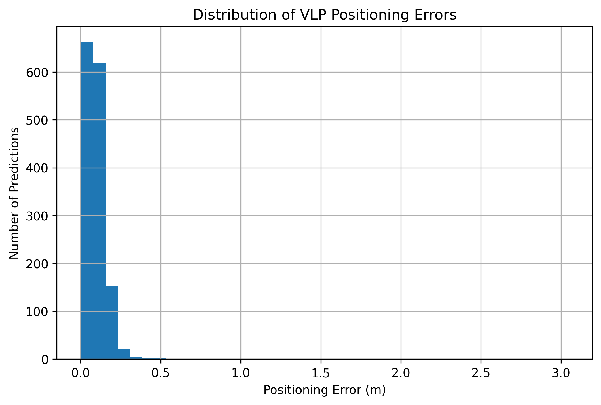
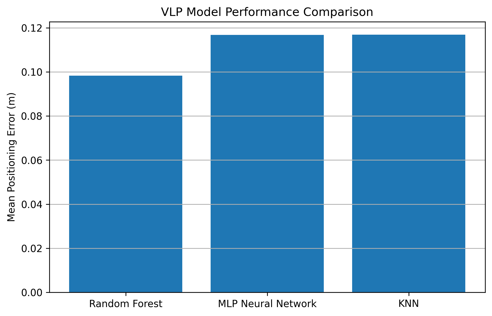
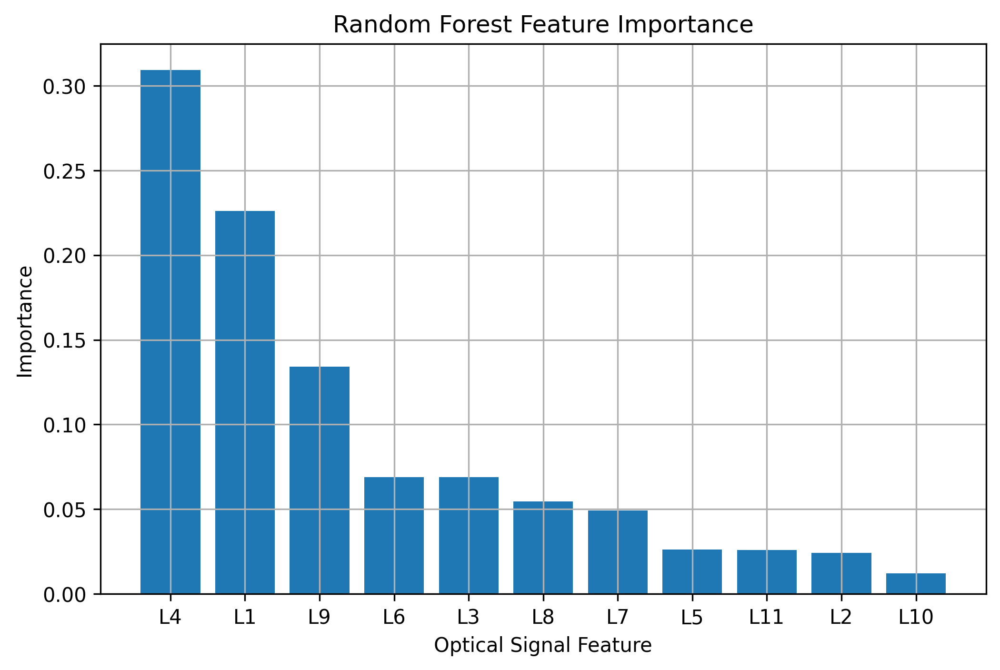

# Machine Learning-Based Visible Light Positioning

A machine learning approach to indoor positioning using optical signal measurements from multiple visible light luminaires.

## Overview

Visible Light Positioning (VLP) uses light-emitting luminaires as reference sources to estimate the position of a receiver. Instead of relying on traditional geometric positioning methods, this project investigates whether machine learning models can learn the relationship between received optical signals and the corresponding receiver coordinates.

The model takes optical signal measurements from multiple luminaires as input and predicts the two-dimensional position of the receiver:

**Optical signal measurements → Machine learning model → (x, y) position**

## Dataset

The dataset contains:

* **7,344 samples**
* **11 optical signal features** (`L1`–`L11`)
* **2 position coordinates** (`x`, `y`)

Each sample represents optical measurements received from multiple luminaires at a known receiver position.

The luminaire locations used in the project are provided in `luminaire_locations.csv`.

> **Note:** The original `Public_VLP_Dataset.csv` is not included in this repository. It is excluded through `.gitignore` because it is an external dataset.

## Methodology

### 1. Data Preparation

The 11 optical signal measurements were used as input features:

`L1, L2, L3, ..., L11`

The target variables were the receiver coordinates:

`x, y`

The dataset was divided into:

* **80% training data**
* **20% testing data**

### 2. Machine Learning Models

Three regression approaches were evaluated:

* Random Forest Regressor
* K-Nearest Neighbours (KNN) Regressor
* Multi-Layer Perceptron (MLP) Regressor

The models were trained to predict the receiver's two-dimensional position directly from the optical signal measurements.

## Results

Performance was evaluated using the mean Euclidean positioning error between the predicted and actual receiver positions.

| Model             | Mean Positioning Error |
| ----------------- | ---------------------: |
| **Random Forest** |            **9.83 cm** |
| MLP               |               11.68 cm |
| KNN               |               11.69 cm |

The **Random Forest model achieved the best performance**, with an average positioning error of approximately **9.83 cm** on the test set.

### Random Forest Error Analysis

Additional analysis of the Random Forest predictions showed:

| Metric          |    Error |
| --------------- | -------: |
| Minimum error   |  0.41 cm |
| Median error    |  8.58 cm |
| Mean error      |  9.83 cm |
| 95th percentile | 19.72 cm |
| Maximum error   |   3.05 m |

The large maximum error indicates that while most predictions were relatively close to the true positions, a small number of samples produced substantially larger errors.

## Visual Results

### Actual vs Predicted Positions



The predicted positions closely follow the actual receiver positions across most of the test samples.

### Positioning Error Distribution



Most positioning errors are concentrated at relatively small distances, although a small number of larger errors are present.

### Model Comparison



Random Forest produced the lowest mean positioning error among the three evaluated models.

### Feature Importance



The Random Forest feature importance analysis indicates that **L4, L1, and L9** contributed most strongly to the model's predictions. Together, these three features accounted for approximately **66% of the total feature importance**.

## Limitations

The current evaluation uses a random train-test split. Because VLP measurements from spatially neighbouring positions may be similar, a random split can produce an optimistic estimate of spatial generalization.

A more rigorous evaluation would use a **spatial holdout strategy**, where locations or regions are excluded from the training data and used exclusively for testing.

The current work therefore demonstrates the feasibility of machine learning-based VLP on the selected dataset but does not yet establish performance on previously unseen spatial regions.

## Future Work

Future development could investigate:

* Spatially separated training and testing regions
* Additional regression and deep learning models
* Hyperparameter optimization
* Feature selection and dimensionality reduction
* Robustness to measurement noise
* Real-time inference on embedded hardware
* Integration with visible light communication systems
* Edge AI implementation for low-power positioning devices

## Repository Structure

```text
ML-Based-VLP/
│
├── Figures/
│   ├── actual_vs_predicted.png
│   ├── error_distribution.png
│   ├── feature_importance.png
│   └── model_comparison.png
│
├── ML_Based_Visible_Light_Positioning.ipynb
├── README.md
├── Requirements.txt
├── luminaire_locations.csv
└── .gitignore
```

## Technologies

* Python
* Pandas
* NumPy
* Matplotlib
* Scikit-learn
* Jupyter Notebook

## Project Focus

This project sits at the intersection of:

**Machine Learning • Visible Light Positioning • Optical Wireless Communication • Indoor Positioning • Intelligent Sensing**

## Author

**Goodnews Osama Imakpokpomwan**

Electrical/Electronics Engineering
University of Benin

Research interests include intelligent sensing, embedded systems, optical wireless systems, and machine learning for sensing applications.


\* NumPy

\* Matplotlib

\* Scikit-learn

\* Google Colab


\## Repository Structure


```text

ML-Based-VLP/

│

├── figures/

│   ├── actual\_vs\_predicted.png

│   ├── error\_distribution.png

│   ├── feature\_importance.png

│   └── model\_comparison.png

│

├── ML\_Based\_VLP.ipynb

├── README.md

└── requirements.txt

```


\## Author


\*\*Goodnews Osama Imakpokpomwan\*\*


Electrical/Electronics Engineering | Intelligent Sensing | Embedded Systems | Photonics \& AI Hardware


